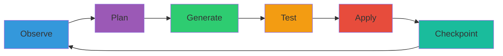
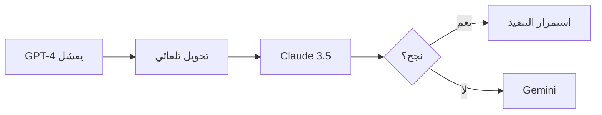

# الأهداف الاستراتيجية الموحدة - AI Kernel

## Strategic Goals & Product Vision - نسخة موحدة شاملة

**تاريخ الإصدار:** يناير 9, 2026  
**المصادر:** VisionAndStrategicGoals.md + FINAL-PRODUCT-VISION.md  
**الحالة:** وثيقة موحدة نهائية 📋

---

## 🎯 التعريف الجوهري

**AI Kernel** هو:

> **Agent لغوي تنفيذي يعمل كلُغة قبل أي شيء، ويتحول إلى أداة تنفيذ حقيقية عند الطلب.**

### الخلاصة في جملة واحدة

> *هو Chat… لكن ما يُقال فيه يحدث فعليًا.*

---

## 📜 الفلسفة الكامنة (The Philosophy)

**الانتقال من الأتمتة البسيطة إلى الذكاء التنفيذي:**

الهدف ليس مجرد **"أتمتة كتابة الكود"**، بل **"أتمتة التفكير البرمجي"**.

### التحول النوعي

```
من: عصر يكتب فيه الإنسان الكود
↓
إلى: عصر يعمل فيه الإنسان كـ "مخرج تقني" (Technical Director)
```

بينما يتولى جيش من الوكلاء:

- إدارة التفاصيل التقنية المعقدة
- المفاضلة بين أفضل الحلول العالمية
- التنفيذ في ثوانٍ بدلاً من ساعات

### المشكلة الحقيقية

ليست نقص الذكاء، بل **فجوة التنفيذ:**

| النماذج اللغوية | أدوات التطوير | AI Kernel |
|-----------------|----------------|-----------|
| تفهم + تشرح + تقترح | تنفّذ بدون فهم | **يفهم + يترجم + يطبّق** |
| ❌ لا تنفذ | ❌ لا تفهم النية | ✅ **يسد الفجوة** |

---

## 🎯 الأهداف القصيرة المدى (Short-term Goals)

### 1. تقليص الفجوة بين الفكرة والتنفيذ

**الهدف:**

- تمكين **غير التقنيين** من بناء Prototypes كاملة
- تمكين **المبرمجين** من السرعة القصوى في التطوير
- **الآلية:** الوصف اللغوي فقط

**القيمة المضافة:**

```javascript
// قبل AI Kernel:
الفكرة → تعلم البرمجة → كتابة الكود → التصحيح → النشر
(أسابيع إلى شهور)

// مع AI Kernel:
الفكرة → @start بناء تطبيق لإدارة المهام → Done
(دقائق إلى ساعات)
```

### 2. ضمان الجودة عبر التعددية

**المبدأ:**

- بدلاً من الاعتماد على ذكاء واحد قد يخطئ
- يعتمد النظام على **"إجماع العقول" (Consensus)**
- لضمان كود آمن وفعال

**الوكلاء المشاركون:**

- OpenAI GPT-4
- Google Gemini
- DeepSeek
- Claude 3.5
- Copilot

**آلية الحكم:**

- مقارنة الحلول
- اختيار الأفضل بناءً على معايير محددة
- إجماع أو تصويت عند التعارض

### 3. بيئة تجريب آمنة

**الهدف:**

- توفير Sandboxes فورية لمعاينة النتائج
- **بدون** الحاجة لضبط بيئات عمل معقدة
- **بدون** المخاطرة بالنظام الأصلي

**التقنيات:**

- E2B Sandboxes
- Docker containers
- File System isolation

---

## 🚀 الرؤية المستقبلية (The Future Evolution)

### 1. النظام المطور لذاته (Self-Improving System)

**الآلية:**


**المكونات:**

- Negative Memory للأخطاء المتكررة
- تحليل أنماط الفشل
- تعديل استراتيجيات التنفيذ
- تحسين جودة القرارات تدريجياً

### 2. تحليل الأنظمة الضخمة (Legacy Modernization)

**القدرة:**

| المدخل | المعالجة | النتيجة |
|--------|-----------|---------|
| مشروع Legacy ضخم | فهم + توثيق + تحليل | نظام حديث مُعاد بناؤه |
| كود غير موثق | توليد Tests تلقائياً | نظام آمن وقابل للصيانة |
| تقنيات قديمة | Modernization تدريجي | migration سلس بدون مخاطر |

**القيمة السوقية:**

- ✅ مشكلة حقيقية منتشرة
- ✅ قيمة سوقية عالية جداً
- ✅ لا يوجد حل جيد حالياً

### 3. البرمجة التفاعلية المستمرة

**ما بعد التسليم:**

```
التطوير → الإطلاق → المراقبة → التحسين التلقائي
                ↑                              ↓
                └──────────────────────────────┘
                    (حلقة مستمرة)
```

**الميزات:**

- مراقبة الأداء بعد الإطلاق
- اكتشاف الثغرات تلقائياً
- اقتراح تحديثات فورية
- إصلاح المشاكل قبل أن تتفاقم

---

## 💎 القيمة المضافة (Value Proposition)

### للمبرمجين 👨‍💻

```diff
- كتابة Boilerplate code يدوياً
- صرف الوقت في المهام الروتينية
- الضياع في التفاصيل التقنية

+ التركيز على الابتكار المعماري
+ حل المشاكل الإبداعية
+ تصميم الأنظمة الكبرى
```

**النتيجة:** المبرمج يصبح Architect بدلاً من Coder

### للشركات 🏢

| المقياس | قبل AI Kernel | مع AI Kernel | التحسن |
|---------|---------------|--------------|--------|
| تكلفة التطوير | عالية | منخفضة | -60% |
| Time-to-Market | أسابيع | أيام | 10x |
| جودة الكود | متغيرة | ثابتة عالية | +80% |
| الصيانة | مكلفة | تلقائية | -70% |

### للجودة 🎯

**الضمانات:**

- ✅ فحص متقاطع بين أقوى نماذج AI في العالم
- ✅ تقليل الأخطاء البشرية بنسبة كبيرة
- ✅ اختبارات تلقائية شاملة
- ✅ تطبيق أفضل الممارسات البرمجية

---

## 🎭 مبدأ التشغيل الأساسي

### القاعدة الذهبية

> **لا يوجد «تشغيل ذاتي غامض» ولا مهام تبدأ من تلقاء نفسها**

### يوجد فقط

1. **أمر لغوي واضح منك** (`@start`)
2. **تنفيذ تلقائي كامل خلفه**

```
الـ Agent:
❌ لا يبدأ من تلقاء نفسه
✅ يبدأ عندما تقول له ابدأ
✅ يستمر ما دمت تسمح
✅ يتوقف فوراً عند أمرك
```

---

## 🎨 واجهة المستخدم (UX Philosophy)

### التصميم

**واحدة فقط:**

- مربع كتابة (Chat)
- سجل ردود

### ما **لا يوجد**

```diff
- Tabs
- Boards
- Panels
- Dashboards معقدة
- Settings لا نهائية
```

### كل التحكم يتم **لغويًا**

---

## 🗣 الأوامر اللغوية (Linguistic Commands)

### صيغة الأوامر

```
لغة طبيعية + كلمات مفتاحية خفيفة (@commands)
```

### 1. أوامر التشغيل

| الأمر | الوظيفة | الأثر |
|-------|---------|-------|
| `@start` | بدء عمل الـ Agent | يبدأ الحلقة التنفيذية |
| `@stop` | إيقاف فوري | Rollback لآخر نقطة آمنة |
| `@pause` | إيقاف آمن | توقف عند أقرب checkpoint |
| `@resume` | استئناف | يكمل من حيث توقف |

### 2. أوامر التوجيه (Plan Override)

```javascript
@focus ركّز فقط على orchestrator.js
@avoid أي تغييرات هيكلية
@limit لا refactor كبير، تحسينات صغيرة فقط
```

**المبدأ:**

- كل أمر يؤثر على **القادم فقط**
- لا يعيد كتابة الماضي إلا بأمر صريح

### 3. أوامر التحكم بالنتائج

```bash
@undo              # تراجع عن آخر تطبيق
@undo all          # تراجع عن الجلسة كاملة
@status            # ماذا يفعل الآن؟
@summary           # ملخص ما تم تطبيقه
```

---

## ⚙️ دورة عمل الـ Agent (Agent Loop)

### الحلقة الكاملة (غير مرئية للمستخدم)



### التفاصيل

1. **Observe** → فهم الحالة الحالية للنظام
2. **Plan** → بناء خطة patches وفق الهدف والقيود
3. **Generate** → توليد patch فعلي (diff)
4. **Test** → تشغيل الاختبارات ذات الصلة
5. **Apply** → تطبيق التغيير تلقائياً عند النجاح
6. **Checkpoint** → حفظ نقطة آمنة للرجوع

### الدورة تتكرر تلقائيًا حتى

- ✅ انتهاء الخطة
- ⏸ صدور أمر منك
- ❌ فشل حرج يتطلب تدخل

---

## 🤖 التنفيذ التلقائي (Auto-Apply)

### المبدأ

```
عند بدء الجلسة (@start):
✅ الـ Agent لا يطلب موافقة على كل خطوة
✅ كل Patch يُطبّق تلقائياً إذا نجح اختباره
❌ أي فشل → تجاهل patch أو rollback
```

### السبب

> **أنت وافقت مسبقاً عندما قلت `@start`**

### الأمان

- كل Patch له Checkpoint
- يمكن التراجع في أي لحظة
- الاختبارات تعمل قبل التطبيق
- Sandbox تحمي النظام الأصلي

---

## 👁 الرؤية الحيّة (Live Feedback)

### أثناء العمل، ترى رسائل مختصرة

```bash
✅ Applied patch: Parallelize orchestrator (+12% performance)
✅ Tests passed: 98/98
⚠️  Skipped patch: test failure in auth.js
🔄 Re-planning: conflict detected
```

### التفاصيل عند الطلب

```bash
@status
→ "Currently: Testing payment gateway integration (step 3/5)"

@summary
→ "Applied 12 patches, improved performance by 18%, fixed 3 security issues"
```

**مبدأ:** بدون إغراق بالتفاصيل، مع توفر المعلومات عند الطلب

---

## 🛡 إدارة الأخطاء والتعافي (Error Handling & Recovery)

### 1. تعافي النماذج (Model Failover)

**المشكلة:**

- تعطل API نموذج معين
- وصول للحد الأقصى (Rate Limit)

**الحل:**



**التقنية:** LiteLLM مع قائمة بدلاء

### 2. تصحيح الكود الذاتي (Self-Debugging Loop)

**الحلقة:**

```javascript
1. Patch يولد كود
2. اختبار في E2B Sandbox
3. فشل؟ → التقاط Stack Trace
4. إعادة للنماذج مع الخطأ
5. توليد patch محسّن
6. تكرار حتى النجاح (max 3 attempts)
```

**الضمان:** لا يصل للمستخدم إلا كود يعمل

### 3. معالجة التناقض (Conflict Resolution)

**السيناريو:**

- 3 نماذج تقترح حلول متناقضة تماماً

**الاستراتيجية:**

```
1. Judge Agent يفعّل جولة تصويت إضافية
2. Multi-turn Debate: كل نموذج ينقد الآخرين
3. إذا استمر التناقض →
   الرجوع للمستخدم بسؤال توضيحي محدد
```

### 4. ذاكرة الأخطاء (Negative Memory)

**المشكلة:** تكرار نفس الخطأ في مراحل مختلفة

**الحل:**

```sql
-- في Vector DB:
INSERT INTO negative_memory (
  error_pattern,
  context,
  solution,
  timestamp
) VALUES (
  'SQL injection in user input',
  'authentication module',
  'use parameterized queries',
  NOW()
);
```

**الفائدة:** قبل كل مهمة جديدة:
> "تجنب الوقوع في الخطأ X الذي حدث في المرحلة السابقة"

---

## 🧠 كيف يتعلّم AI Kernel؟

### مصادر التعلم (من سلوكك)

| الإشارة | المعنى | التأثير |
|---------|--------|---------|
| تركته يكمل | ✅ النهج صحيح | تعزيز نفس الاستراتيجية |
| `@stop` سريع | ❌ خطأ في الاتجاه | تجنب هذا النمط |
| `@focus` جديد | 🔀 تغيير الأولويات | تعديل خطة التنفيذ |
| `@undo` | ⚠️ نتيجة غير مرغوبة | Negative Memory |

### النتيجة

> **التعلم يُحسّن التخطيط القادم دون أن يغيّر طريقة تعاملك معه**

---

## 🏗 هيكلية النظام (System Architecture)

### طبقة 1: الواجهة والتخطيط (Interface & Planning)

#### الوكيل المترجم (The Architect/PM)

- **الدور:** الجسر بين المستخدم والنظام
- **المهمة:**
  - تحليل النص البشري
  - استكمال النواقص عبر الحوار
  - تحويلها إلى Spec Document

#### الوكيل المنسق (The Orchestrator/Manager)

- **الدور:** مدير العمليات التقني
- **المهمة:**
  - إدارة تدفق الحالة (State)
  - توزيع المهام
  - اتخاذ قرار الانتقال بين المراحل

### طبقة 2: المعالجة الذكية (Intelligence Processing)

#### الوكيل المنظم (Context Organizer)

- **الدور:** مدير الذاكرة
- **المهمة:**
  - استرجاع سياق المشروع من Vector DB
  - ضمان اتساق المراحل
  - ربط Frontend بـ Backend

#### الوكيل المحرر (Prompt Engineer Agent)

- **الدور:** محسن الاستعلامات
- **المهمة:**
  - صياغة Prompts متخصصة لكل نموذج
  - ضمان أفضل مخرجات تقنية

### طبقة 3: التنفيذ والمقارنة (Execution & Comparison)

#### الوكلاء السائلون (Model Workers)

- **الدور:** منفذو الاستعلامات
- **المهمة:** جلب الحلول من النماذج عبر LiteLLM

#### الوكيل المختبر (DevOps/QA Agent)

- **الدور:** ضمان الجودة
- **المهمة:**
  - تشغيل الكود في E2B Sandbox
  - قياس الأداء
  - تقديم رابط معاينة

---

## 🔄 تدفق العمل (Workflow Logic)

### 1. حلقة الاستشارة (Consultation Loop)

```
المترجم يحاور المستخدم
    ↓
الحكم يولد خطة تقنية
    ↓
المستخدم يوافق أو يعدل
    ↓
    ⟲ (تكرار حتى الموافقة)
```

### 2. حلقة التنفيذ (Implementation Loop)

```
الحكم يرسل المهام للمحرر
    ↓
السائلون يجلبون الحلول
    ↓
الحكم يقارن ويختار الأفضل
    ↓
المختبر يشغل الكود
    ↓
    ⟲ (تكرار حتى الاكتمال)
```

### 3. حلقة التراكم (Evolutionary Loop)

```
تخزين تفاصيل المرحلة المنتهية
    ↓
في الذاكرة المركزية (Vector DB)
    ↓
مرجع للمرحلة التالية
```

---

## 🛠 المكونات التقنية (Technology Stack)

### الحالي (v0.5.0)

```yaml
Backend:
  - اللغة: JavaScript (Node.js)
  - Framework: Express.js
  - Models: OpenAI, Gemini, DeepSeek, Claude, Copilot, Mock
  - Database: SQLite (in-memory + persistent)
  - WebSocket: ws library
  
Frontend:
  - HTML5 + CSS3 + Vanilla JavaScript
  - Unified Interface
  - Real-time updates
  
Testing:
  - 92 unit + integration tests
  - Jest framework
```

### المستهدف (Future)

```yaml
Language: Python
Orchestration: LangGraph
Model Interface: LiteLLM
Sandbox: E2B
Vector DB: ChromaDB
Memory: Persistent + Vector-based
```

---

## ⚖️ ميثاق الحكم (The Judging Rubric)

### معايير المفاضلة بين النماذج

| المعيار | الوزن | القياس |
|---------|-------|--------|
| **الأداء** | 30% | سرعة التنفيذ + استهلاك الموارد في E2B |
| **النظافة** | 25% | اتباع معايير التوثيق + تسمية المتغيرات |
| **الأمان** | 25% | خلو من الثغرات البرمجية |
| **التوافق** | 20% | الانسجام مع الكود السابق في الذاكرة |

### آلية التصويت

```python
def judge_solutions(solutions):
    scores = []
    for solution in solutions:
        score = (
            solution.performance * 0.30 +
            solution.cleanliness * 0.25 +
            solution.security * 0.25 +
            solution.compatibility * 0.20
        )
        scores.append((solution, score))
    
    # اختيار الأفضل
    return max(scores, key=lambda x: x[1])
```

---

## 📡 بروتوكول التواصل بين الوكلاء (Inter-Agent Communication)

### JSON Schema موحد

```json
{
  "sender": "Agent_Name",
  "target": "Target_Agent",
  "task_id": "UUID",
  "status": "success | failure | pending",
  "payload": {
    "data": "...",
    "context_ref": "Memory_ID"
  },
  "error_log": null
}
```

### الفائدة

- ✅ لا تشتت سياقي
- ✅ تتبع كامل للمهام
- ✅ قابلية استعادة الحالة

---

## 🏆 دور المجلس (Council)

### المبدأ الأساسي

> **المجلس موجود لكنه غير مرئي**

### الخصائص

```diff
+ عدة نماذج تفكر بطرق مختلفة
+ تحسين جودة القرار داخلياً
- لا يظهر للمستخدم من قال ماذا
- لا يحتاج المستخدم لإدارته
```

### الوظيفة الوحيدة

> تحسين جودة القرار والتنفيذ داخليًا

---

## 🚫 ما الذي **ليس** AI Kernel

### التوضيح

```diff
❌ ليس IDE
❌ ليس لوحة تحكم
❌ ليس CI/CD بديل
❌ ليس نظام برمجة بواجهات
❌ ليس Code Generator بسيط

✅ هو: Agent لغوي تنفيذي
```

---

## 📜 ميثاق العمل (The Mission Statement)

> **"نحن نبني كياناً رقمياً لا يكتفي بتنفيذ الأوامر، بل يفهم السياق، ويتعلم من الأخطاء، ويقدم حلولاً برمجية تضاهي في جودتها وتنسيقها عمل كبار المهندسين، مع الحفاظ على شفافية كاملة وقدرة المستخدم على التدخل في أي لحظة."**

---

## 🎯 الجملة النهائية (Final Definition)

> **AI Kernel هو نموذج لغوي يتصرف كـ Agent،  
> ويعمل تلقائياً عندما تكتب،  
> ويتوقف فورًا عندما تطلب.**

---

## ✅ ملخص تنفيذي (Executive Summary)

### الأهداف الرئيسية (مرتبة حسب الأولوية)

1. **سد فجوة التنفيذ** - من الفكرة إلى الكود مباشرة
2. **ضمان الجودة** - عبر إجماع نماذج متعددة
3. **الأمان التلقائي** - Sandboxing + Testing + Rollback
4. **التعلم المستمر** - من سلوك المستخدم والأخطاء
5. **البساطة القصوى** - واجهة لغوية بحتة
6. **Legacy Modernization** - إحياء الأنظمة القديمة

### المبادئ غير القابلة للتفاوض

- ✅ **شفافية كاملة** - المستخدم يعرف ما يحدث
- ✅ **تحكم كامل** - يمكن الإيقاف/التراجع في أي لحظة
- ✅ **تنفيذ تلقائي** - بدون موافقات متكررة مملة
- ✅ **لغوي أولاً** - كل شيء يتم بالكلمات

---

## 📚 المراجع

1. [VisionAndStrategicGoals.md](file:///C:/Users/Bakheet/Documents/Projects/AI/docs/VisionAndStrategicGoals.md)
2. [FINAL-PRODUCT-VISION.md](file:///C:/Users/Bakheet/Documents/Projects/AI/docs/FINAL-PRODUCT-VISION.md)
3. [PHASED-ROADMAP.md](file:///C:/Users/Bakheet/Documents/Projects/AI/docs/PHASED-ROADMAP.md)
4. [ARCHITECTURAL-VISION.md](file:///C:/Users/Bakheet/Documents/Projects/AI/docs/ARCHITECTURAL-VISION.md)

---

**النسخة:** 1.0  
**التاريخ:** يناير 9, 2026  
**الحالة:** وثيقة موحدة نهائية ✅
